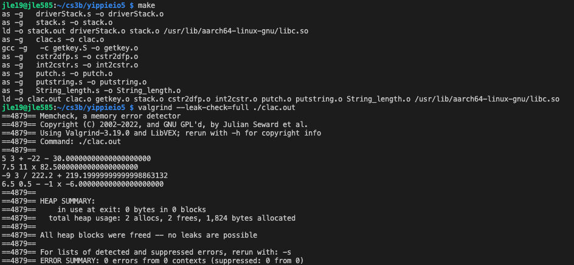
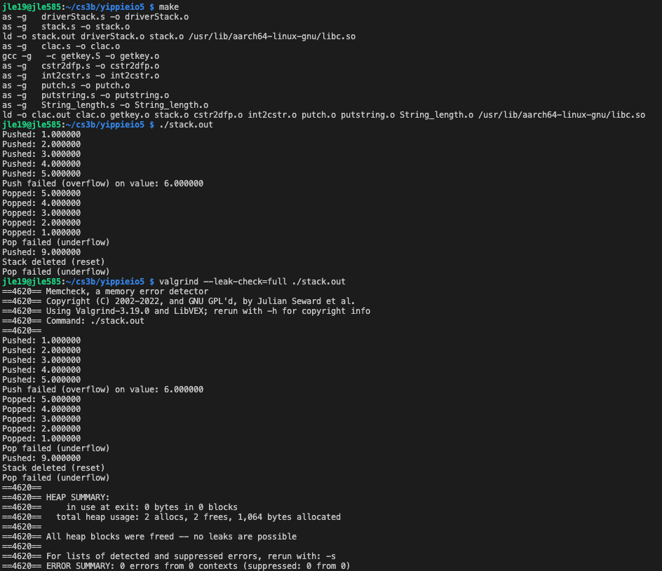

# Reverse Polish Notation Calculator

A reverse Polish notation (RPN) calculator written entirely in AArch64 assembly, running bare on a Raspberry Pi. Input comes from a 4x4 matrix keypad wired directly to the Pi's GPIO header — the keypad is scanned by hand in assembly, no drivers or libraries in between — and results print to the console as double-precision floating point.

Built by **Justine Le** and **Tyler Kulikowski** for CS3B (Assembly Language Programming), May 2025.



## What it does

Operands and operators are entered on the keypad in postfix order and pushed onto a dynamically allocated stack. Pressing enter once applies the pending operator; pressing it a second time prints the result; a third enter tears down the stack and exits.

```
5 3 + -22 -     ->  30.00000000000000000000
7.5 11 x        ->  82.50000000000000000000
-9 3 / 222.2 +  ->  219.19999999999998863132
6.5 0.5 - -1 x  ->  -6.00000000000000000000
```

Supports `+`, `-`, `x`, `/`, decimal fractions, and negative operands. A leading `-` followed by a digit is read as a negative number; a leading `-` followed by enter is read as subtraction.

## Hardware

A 4x4 matrix keypad connected to the Raspberry Pi's GPIO header:

| Role | GPIO pins |
| --- | --- |
| Rows (output) | 4, 17, 27, 22 |
| Columns (input) | 18, 23, 24, 25 |

`getkey` scans the matrix by driving one row high at a time, reading each column, and mapping the row/column intersection to a key number 1–16. It blocks until a key is pressed. GPIO is reached by `mmap`-ing `/dev/gpiomem` and writing the function-select, set, clear, and level registers directly.

The keypad's physical labels map to calculator symbols like this:

```
 1   2   3   /
 4   5   6   x
 7   8   9   -
 .   0  ENT  +
```

## Source files

| File | Purpose |
| --- | --- |
| [clac.s](clac.s) | Main program — keypad loop, operand building, operator dispatch, enter-count state machine |
| [getkey.S](getkey.S) | Blocking 4x4 keypad scan, returns key 1–16 |
| [gpiomem.S](gpiomem.S) | GPIO macros: memory mapping, pin direction, set/clear, read level, nanosleep |
| [fileio.S](fileio.S) | Linux syscall macros for open/read/write/close (used by `gpiomem.S`) |
| [stack.s](stack.s) | Dynamic double-precision stack: `stackConstructor`, `stackDestructor`, `push`, `pop`, `delete` |
| [driverStack.s](driverStack.s) | Standalone test driver for the stack, exercising overflow and underflow |
| [cstr2dfp.s](cstr2dfp.s) | Converts a null-terminated numeric C-string to a double in `D0` |
| [putch.s](putch.s) | Writes a single character to stdout |
| [putstring.s](putstring.s) | Writes a null-terminated string to stdout |
| [String_length.s](String_length.s) | Returns the length of a null-terminated string |

### The stack

Backed by `malloc`, sized at construction (100 elements × 8 bytes in `clac`). Overflow is refused rather than fatal — `push` returns 0 and leaves the stack untouched; `pop` on an empty stack returns `0.0`. `delete` resets the stack pointer without freeing.



Both binaries run clean under `valgrind --leak-check=full`: no leaks, no errors.

## Building

Requires a 64-bit Raspberry Pi OS (AArch64) with `gcc`, `as`, `ld`, and `glibc`. Rename `makefile.txt` to `makefile`, then:

```sh
make            # builds stack.out and clac.out
make DEBUG=1    # builds with debug symbols
make clean
```

Run:

```sh
./stack.out     # stack unit test driver
./clac.out      # the calculator (needs GPIO access for the keypad)
```

Note: `makefile.txt` lists `int2cstr.o` in the `clac.out` objects, but `int2cstr.s` is not checked in here — you'll need to supply it or drop it from `FLASHMEMOBJS` before linking.

## Credits

The `fileio.S` macros and most of the `gpiomem.S` macros were written by Stephen Smith (*Raspberry Pi Assembly Language Programming*); `GPIODirectionIn` and `GPIOReadLevelBit` were added by us. Everything else is ours.
